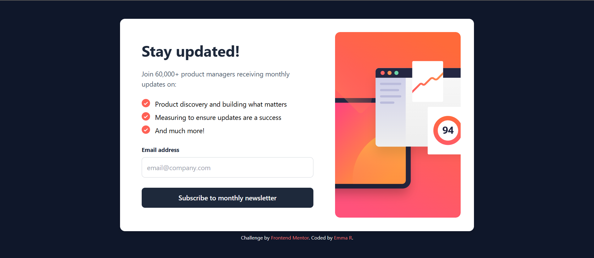

Here is a template for the README of your project:

---

# Newsletter Sign-Up Form with Success Message

This is a solution to the [Newsletter sign-up form with success message challenge on Frontend Mentor](https://www.frontendmentor.io/challenges/newsletter-signup-form-with-success-message-3FC1AZbNrv). Frontend Mentor challenges help you improve your coding skills by building realistic projects.

## Table of contents

- [Overview](#overview)
  - [The challenge](#the-challenge)
  - [Screenshot](#screenshot)
  - [Links](#links)
- [My process](#my-process)
  - [Built with](#built-with)
  - [What I learned](#what-i-learned)
  - [Continued development](#continued-development)
  - [Useful resources](#useful-resources)
- [Author](#author)
- [Acknowledgments](#acknowledgments)

## Overview

### The challenge

Users should be able to:

- Add their email and submit the form.
- See a success message with their email after successfully submitting the form.
- See form validation messages if:
  - The field is left empty.
  - The email address is not formatted correctly.
- View the optimal layout for the interface depending on their device's screen size.
- See hover and focus states for all interactive elements on the page.

### Screenshot



### Links

- Solution URL: [Add solution URL here](https://your-solution-url.com)
- Live Site URL: [Add live site URL here](https://your-live-site-url.com)

## My process

### Built with

- Semantic HTML5 markup
- Tailwind CSS for styling
- JavaScript for form validation
- Validator.js for email validation
- Mobile-first design approach

### What I learned

During this project, I improved my skills in form handling and validation, especially for email inputs. I learned how to:

- Use Tailwind CSS to quickly build responsive layouts.
- Apply form validation to ensure correct input before submission.
- Use JavaScript to dynamically update the UI, switching between the form and success message.
- Handle various states, such as error messages and success notifications, effectively.

```html
<form>
  <input type="email" id="email_address" placeholder="email@company.com" />
</form>
```
```js
const emailValue = document.getElementById("email_address").value;
if (!validator.isEmail(emailValue)) {
  showError("Valid email required");
}
```

### Continued development

In future projects, I plan to:

- Refine my skills in JavaScript, especially related to form validation and UI state management.
- Learn more about accessibility features to ensure that my forms are user-friendly for all people.
- Explore using other JavaScript libraries for handling forms and validation.

### Useful resources

- [Tailwind CSS Documentation](https://tailwindcss.com/docs) - The official documentation helped me build a responsive layout with ease.
- [Validator.js](https://github.com/validatorjs/validator.js) - This library made it simple to handle email validation.
- [Frontend Mentor Community](https://www.frontendmentor.io/community) - A great place to get feedback and connect with other developers.

## Author

- Website - [Emma R](https://www.emma-roizot.fr)
- Frontend Mentor - [@ashandcompany](https://www.frontendmentor.io/profile/ashandcompany)

## Acknowledgments

Thanks to Frontend Mentor for providing the challenge and resources. Special thanks to the community for their feedback and support throughout the project.